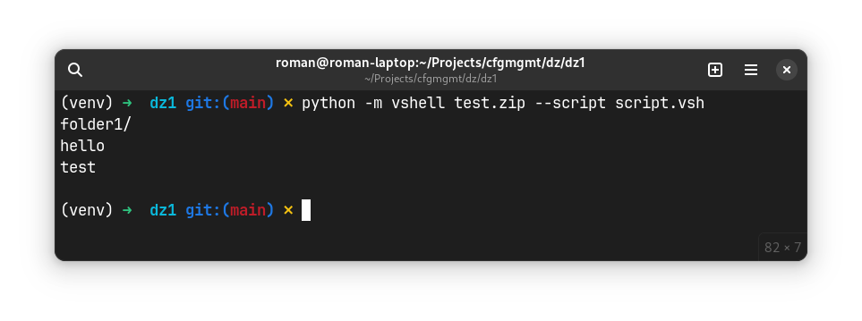

# Задание
Разработать эмулятор командной строки vshell.
В качестве аргумента vshell принимает образ файловой системы известного формата (tar, zip).

Обратите внимание: программа должна запускаться прямо из командной строки, а файл с виртуальной файловой системой не нужно распаковывать у пользователя.
В vshell должны поддерживаться команды pwd, ls, cd и cat.

Необходимо поддержать ключ командной строки `--script имя_файла` для загрузки списка выполняемых команд из файла.
Кроме того, в коде должна присутствовать функция тестирования всех реализованных команд.

Ваша задача сделать работу vshell как можно более похожей на сеанс bash в Linux.
Реализовать vshell можно на Python или других ЯП, но кроссплатформенным образом.

## Исходный код
Исходный код представлен в листингах @pyprojectcode-@vshellcode.

%pyprojectcode Исходный код файла pyproject.toml

```python ./vshell/pyproject.toml
```

%maincode Исходный код файла vshell/__main__.py

```python ./vshell/vshell/__main__.py
```

%vshellcode Исходный код файла vshell/vshell.py


```python ./vshell/vshell/vshell.py
```

## Пример работы
Пример работы представлен на рис. @vshellexample.

Пример работы скрипта(листинг @scriptvsh), вызванного при помощи параметра 
`--script` представлен на рис. @vshellscriptexample.


%scriptvsh Код файла script.vsh

```python ./script.vsh
```



## Вывод
При выполнения данной работы были изучены работа эмуляторов командной
строки и ее простейших команд. В результате был написан свой эмулятор командной 
строки для zip архивов.
