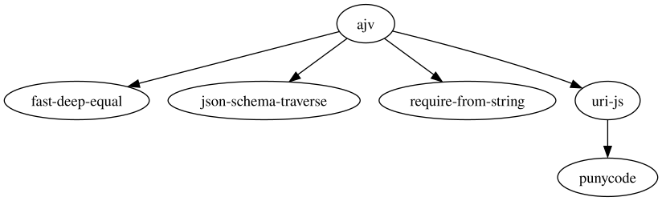
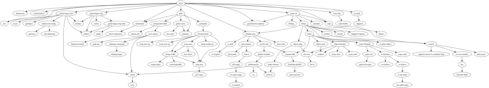

# Задание
Написать на выбранном вами языке программирования программу, которая принимает в качестве аргумента командной строки имя пакета, а возвращает граф его зависимостей в виде текста на языке Graphviz. На выбор: для npm или для pip. Пользоваться самими этими менеджерами пакетов запрещено. Главное, чтобы программа работала даже с неустановленными пакетами и без использования pip/npm.

## Исходный код
%pyprojectcode Исходный код файла pyproject.toml

```python ./dependency_visualizer/pyproject.toml
```

%maincode Исходный код файла dependency_visualizer/__main__.py

```python ./dependency_visualizer/dependency_visualizer/__main__.py
```

%dependency_visualizercode Исходный код файла dependency_visualizer/dependency_visualizer.py


```python ./dependency_visualizer/dependency_visualizer/dependency_visualizer.py
```

## Примеры

Примеры графов, сгенерированных программой представлены на рисунках @ajvgraph, @gruntgraph.





## Вывод

При выполнения данной работы были изучены работа различных пакетных менеджеров. В результате был написана программа для генерации графов зависимостей npm-пакетов для Graphviz.
