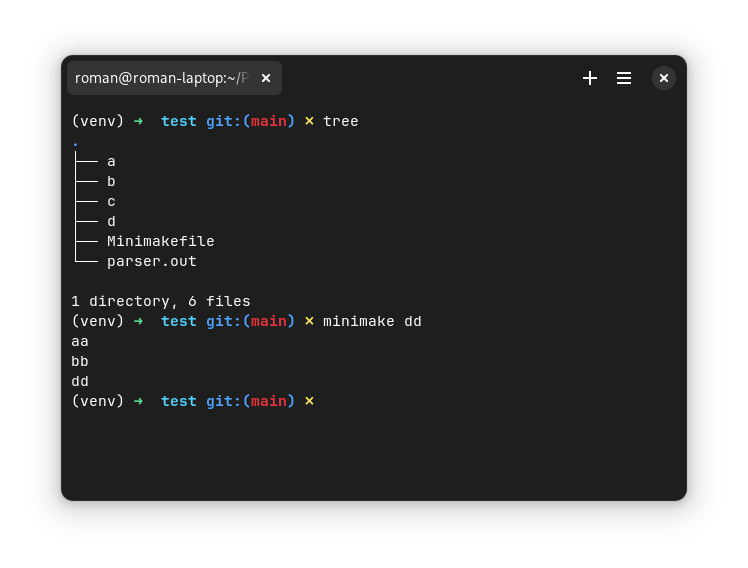
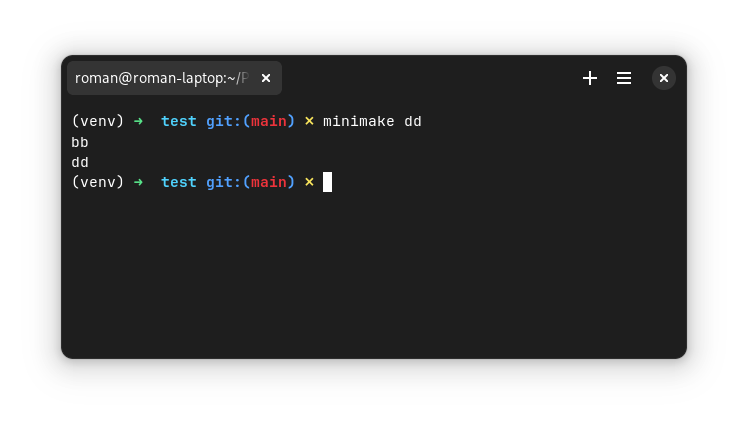

# Задание
Реализовать свою мини-версию Make.

Для описания задач, зависимостей и команд можно использовать язык реализации (если это скриптовый язык в духе Питона) или же реализовать собственный язык с помощью средств из ДЗ 3. Если у вас нет хороших идей на этот счет, то используем синтаксис make, но позволяем отступы делать "по-человечески", а не только с помощью "\t".

Для определения порядка выполнения задач должен использоваться алгоритм топологической сортировки. Уже выполненные задачи повторно не выполняются.

Для определения изменений в зависимостях задач (файлах и других видах данных) необходимо использовать не время изменения файла, а хеш-значения, см. https://medium.com/@buckaroo.pm/build-systems-should-use-hashes-over-timestamps-54d09f6f2c4

Обратите внимание, вам нужно хешировать содержимое файлов. То есть для хранения аналога файловой системы с информацией о файлах вполне можно использовать тот же JSON-объект, а вот хешировать сами данные лучше чем-нибудь проверенным, с малой вероятностью коллизий. Посмотрите стандартную библиотеку. Для Питона это https://docs.python.org/3/library/hashlib.html

Проверить работоспособность реализованной системы автоматизации сборки на примере civgraph (том варианте, где создаются файлы!), а также на собственном примере компиляции приложения.

Иными словами, идеальное решение подразумевает настоящую, пусть и примитивную, систему сборки, которая работала бы с реальными файлами и произвольными командами, а также включала в себя БД в каком-то виде для хранения состояния между запусками.

## Результат выполнения
В результате была написана программа, которая реализует мини-версию Make с использованием алгоритма топологической сортировки для определения порядка выполнения задач. Эта программа также использует хеш-значения для определения изменений в зависимостях задач, вместо времени изменения файлов.

Для хеширования содержимого файлов программа использует стандартную библиотеку hashlib в Python. Это позволяет создавать хеши данных с низкой вероятностью коллизий и использовать их для определения изменений в файлах. Хеши файлов хранятся в виде json-файла `.minimake_hashes`.

Программа также предоставляет возможность определять задачи, их зависимости и команды для выполнения. Отступы в описаниях задач можно делать "по-человечески", что делает синтаксис более читаемым.

Кроме того, программа поддерживает выполнение задач только в случае, если они еще не были выполнены ранее. Это позволяет экономить время и ресурсы, не выполняя одни и те же задачи повторно.

## Пример использования
Для работы программы требуется создать файл `Minimakefile`. (лист. @minimakefile)

%minimakefile Пример файла Minimakefile
```make test/Minimakefile
```

Запустим программу первый раз (рис. @run1).



Изменим файл `b`. Запустим программу еще раз. В этот раз выполнятся только правила `bb` и `dd` (рис. @run2).



## Исходный код

% Исходный код файла minimake/minimake/__main__.py
```python ./minimake/minimake/__main__.py
```

% Исходный код файла minimake/minimake/dataclasses/rule.py
```python ./minimake/minimake/dataclasses/rule.py
```

% Исходный код файла minimake/minimake/dataclasses/variable.py
```python ./minimake/minimake/dataclasses/variable.py
```

% Исходный код файла minimake/minimake/dataclasses/makefile.py
```python ./minimake/minimake/dataclasses/makefile.py
```

% Исходный код файла minimake/minimake/minimake.py
```python ./minimake/minimake/minimake.py
```

% Исходный код файла minimake/minimake/hashes_manager.py
```python ./minimake/minimake/hashes_manager.py
```

% Исходный код файла minimake/minimake/graph.py
```python ./minimake/minimake/graph.py
```

% Исходный код файла minimake/minimake/make_file_parser.py
```python ./minimake/minimake/make_file_parser.py
```

% Исходный код файла minimake/minimake/makefile_lexer.py
```python ./minimake/minimake/makefile_lexer.py
```

% Исходный код файла minimake/pyproject.toml
```toml ./minimake/pyproject.toml
```