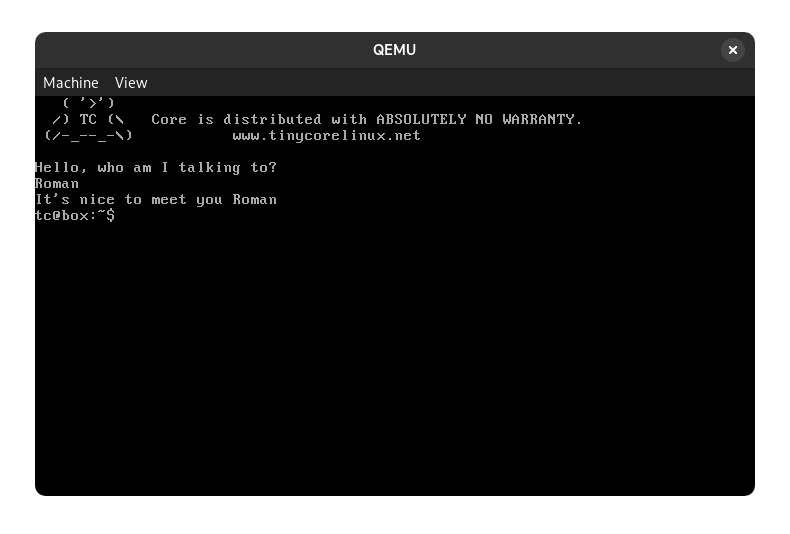
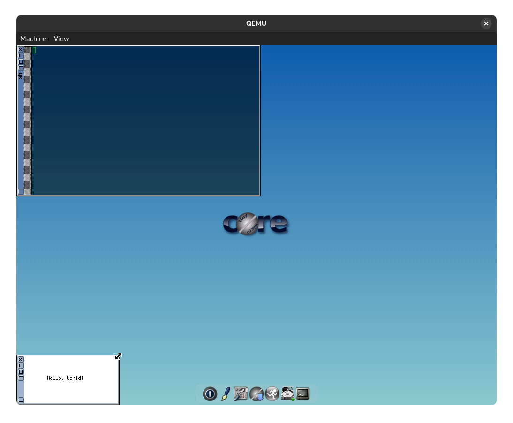

# Примеры работы
## 1. Исполнение shell скрипта
Команда:
```
sandboxer test.sh
```

Результат:


## 2. Исполнение бинарной программы с графическим интерфейсом
Команда:
```
sandboxer hellox11 --with-gui
```

Результат:


## 3. Компиляция программы из исходного файла с выводом в файл
Команда:
```
sandboxer --from-source hello_src --headless-output out.txt
```
где hello_src - папка с исходным кодом и Makefile, содержащим правило run.

Результат (текст файла out.txt):
```

g++ -o hello hello.cpp
./hello
hello world
```