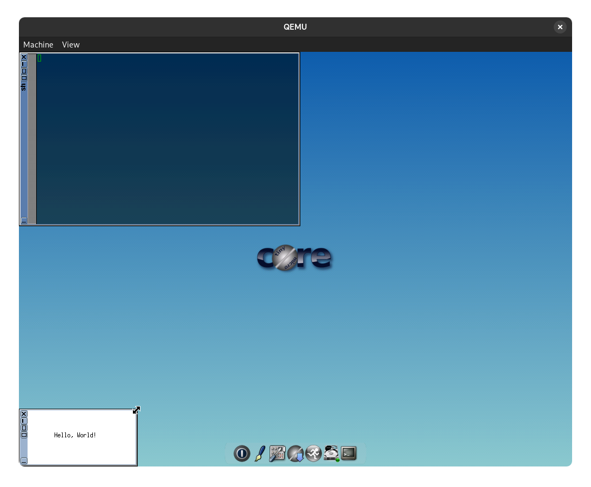

# Задание
Реализовать выполнение программ студентов, написанных на C/C++, в "песочнице", организованной с помощью QEMU и образа Linux.

Цель – не позволить некорректной или вредоносной программе сломать всю систему. Подобные "песочницы" используются, к примеру, у исследователей из антивирусных компаний, которые анализируют новые вредоносные программы.

Решение должно работать в Windows и Linux.

Размер всех данных для "песочницы" не должен превышать 512 Мб (не включая сам QEMU).

Необходимо продумать способ автоматически загружать новые исходные тексты в виртуальный Linux, а после завершения работы проверяемой программы – получать данные в хост-систему.

## Результат выполнения
В результате выполнения была написана программа позволяющая запускать консольные и графические программы, а также производить их сборку использую Make в виртуальной машине QEMU с дистрибутивом GNU/Linux TinyCore.

## Принцип работы программы
Программа распаковывает готовый образ дистрибутива GNU/Linux TinyCore и хранящийся в нем образ корневой файловый системы в формате CPIO. Далее туда загружаются программа/исходные коды, производится настройка автозагрузки программы (и, при необходимости, ее сборки), производится настройка загрузчика и т.д. После этого образ запаковывается обратно и происходит его запуск через QEMU.

## Примеры работы
### Исполнение shell скрипта
Команда: `sandboxer test.sh`

Результат:


### Исполнение бинарной программы с графическим интерфейсом
Команда: `sandboxer hellox11 --with-gui`

Результат:


### Компиляция программы из исходного файла с выводом в файл
Команда: `sandboxer --from-source hello_src --headless-output out.txt`, где `hello_src` - папка с исходным кодом и Makefile, содержащим правило run.

Результат (текст файла out.txt):

```
g++ -o hello hello.cpp
./hello
hello world
```

## Исходный код
% Исходный код файла sandboxer/sandboxer/__main__.py
```python ./sandboxer/sandboxer/__main__.py
```

% Исходный код файла sandboxer/sandboxer/sandboxer.py
```python ./sandboxer/sandboxer/sandboxer.py
```

% Исходный код файла sandboxer/sandboxer/copy_iso.py
```python ./sandboxer/sandboxer/copy_iso.py
```

% Исходный код файла sandboxer/sandboxer/libcpio/__init__.py
```python ./sandboxer/sandboxer/libcpio/__init__.py
```

% Исходный код файла sandboxer/sandboxer/libcpio/cpio_archive.py
```python ./sandboxer/sandboxer/libcpio/cpio_archive.py
```

% Исходный код файла sandboxer/sandboxer/libcpio/cpio_entry.py
```python ./sandboxer/sandboxer/libcpio/cpio_entry.py
```

% Исходный код файла sandboxer/sandboxer/libcpio/cpio_entry.py
```python ./sandboxer/sandboxer/libcpio/cpio_entry.py
```

% Исходный код файла sandboxer/pyproject.toml
```toml ./sandboxer/pyproject.toml
```
