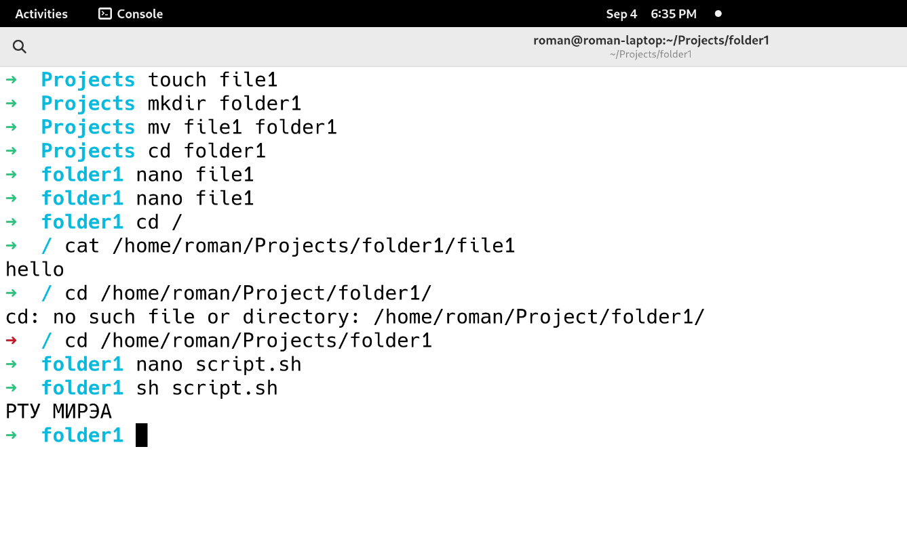

# *СОДЕРЖАНИЕ
[TOC]

# Задания с доски
## Задание 1
Задание: сделать файл и папку.

- Создадим файл `file1` при помощи команды `touch`. 
- Создадим папку `folder1` при помощи команды `mkdir`.

```bash
touch file1
mkdir folder1
```

## Задание 2
Задание: переместить 1 в 2.

```bash
mv file1 folder1
```

## Задание 3
Задание: изменить содержание файла и вывести его с дир. root.

```bash
cd ..
cat folder1/file1
```

## Задание 4
Задание: написать и запустить скрипт на вывод сообщения "РТУ МИРЭА".
```bash
echo "РТУ МИРЭА"
```

Запустим скрипт: `sh script.sh`.

Вывод: ```РТУ МИРЭА```

## Скриншот
Результат выполнения задний 1-4 показан на рис. @tasks1to4



# Практическое занятие №1. Введение, основы работы в командной строке
Выполним задания из https://github.com/true-grue/kisscm/blob/main/pract/pract1.md.

## Задание 1
Задание: вывести отсортированный в алфавитном порядке список имен пользователей в файле passwd (вам понадобится grep).

Выполним команду `grep -o "^[^:]*" /etc/passwd`. Параметр `-o` означает что будет осуществлен вывод только найденных частей. `^` в начале паттерна означает начало строки. `[^:]*` означает любой символ кроме `:`. `*` означает, что предыдущий параметр повторяется 0 или более раз.

Вывод представлен в листинге @etcpasswd.

%etcpasswd Вывод пользователей из файла /etc/passwd.

```
root
bin
daemon
mail
ftp
http
nobody
dbus
systemd-coredump
systemd-network
systemd-oom
systemd-journal-remote
systemd-resolve
systemd-timesync
tss
uuidd
roman
avahi
gdm
geoclue
polkitd
rtkit
usbmux
colord
git
nm-openvpn
openvpn
saned
cups
plex
systemd-journal-upload
```

## Задание 2
Задание: вывести данные /etc/protocols в отформатированном и отсортированном порядке для 5 наибольших портов.

Выполним команду ```cat /etc/protocols | grep "^.\+ \+[0-9]\+ \+.\+" | awk '{print $2" "$3}' | sort -n -r | head -n 5```. `cat` обозначает вывод файла. `grep` выводит только строки подходящие под паттерн: 
один или более любых символов, один или несколько пробелов, одна или более цифр, один или несколько пробелов, один или более любых символов. `awk` выводит вторую и третью части строки, разделенные пробелом. `sort` сортирует строки в обратном порядке (`-r`), учитывая цифры (`-n`). `head` выводит первые пять (`-n 5`) строк.

Вывод представлен в листинге @etcprotocols.

%etcprotocols Вывод отформатированных и отсортированных данных из /etc/protcols.

```
255 Reserved
145 NSH
144 AGGFRAG
143 Ethernet
142 ROHC
```

## Задание 3
Задание: написать программу banner средствами bash для вывода текстов, как в следующем примере (размер баннера должен меняться!).

Код скрипта представлен в листинге @banner. В первой строке инициализируется переменная `TEXT` со значением первого аргумента программы. Далее при помощи `expr length` подсчитывается количество символов в `TEXT`. Затем объявляется функция print_border, которая выводит плюс, `TEXT_LENGTH+2` минусов и плюс. Далее вызывается функция print_boder, выводится `$TEXT`, еще раз вызывается функция print_boder. 

%banner Код скрипта banner

```bash
TEXT=$1;

TEXT_LENGTH=$(expr length "$1");

function print_border {
    printf "+";
    for ((i=1;i<=$TEXT_LENGTH+2;i++));
    do
        printf "-"
    done;
    printf "+\n"
}

print_border;
echo "| $TEXT |";
print_border;
```

## Задание 4
Скип

## Задание 5
```
chmod +x "$1";
mv "$1" /usr/local/bin
```

## Задание 6
Задание: написать программу для проверки наличия комментария в первой строке файлов с расширением c, js и py.

Код программы предоставлен в листинге @task6.

%task6 Код программы для задания 6.

```bash
FIRST_LINE=$(cat $1 | head -n 1)

if { [[ $1 == *".py" ]] && $(echo $FIRST_LINE | grep -q "^ *#"); } \
|| { [[ $1 == *".c" ]] && $(echo $FIRST_LINE | grep -q -e "//.\+" -e "/*.\+\*/"); } \
|| { [[ $1 == *".js" ]] && $(echo $FIRST_LINE | grep -q -e "//.\+"); }; then
    echo "comment found";
else
    echo "comment not found"
fi
```

## Задание 7
Задание: написать программу для нахождения файлов-дубликатов (имеющих 1 или более копий содержимого) по заданному пути (и подкаталогам).

Скип

## Задание 8
Задание: написать программу, которая находит все файлы в данном каталоге с расширением, указанным в качестве аргумента и архивирует все эти файлы в архив tar.

Код программы предоставлен в листинге @task8.

%task8 Код программы для задания 8.

```bash
tar -czf archive.tar *."$1"
```

## Задание 9
Задание: написать программу, которая заменяет в файле последовательности из 4 пробелов на символ табуляции. Входной и выходной файлы задаются аргументами.

Код программы предоставлен в листинге @task9.

%task9 Код программы для задания 9.

```bash
sed 's/    /\t/g' $1 > $2
```

## Задание 10
Задание: написать программу, которая выводит названия всех пустых текстовых файлов в указанной директории. Директория передается в программу параметром.

Код программы предоставлен в листинге @task10.

%task10 Код программы для задания 10.

```bash
find . -type f
```
