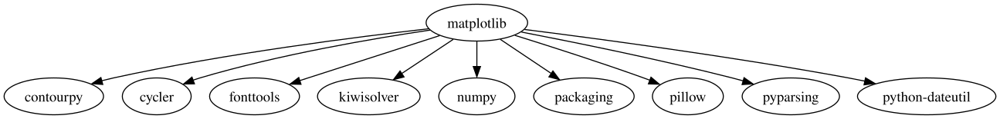
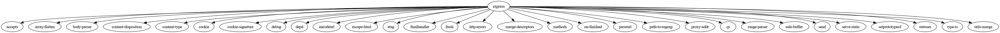

## Задание 1
Вывести служебную информацию о пакете matplotlib (Python). Разобрать основные элементы содержимого файла со служебной информацией из пакета. Как получить пакет без менеджера пакетов, прямо из репозитория?

Решение:


## Задание 2
Вывести служебную информацию о пакете express (JavaScript). Разобрать основные элементы содержимого файла со служебной информацией из пакета. Как получить пакет без менеджера пакетов, прямо из репозитория?

Решение:


## Задание 3
Сформировать graphviz-код и получить изображения зависимостей matplotlib и express.

Решение:

```_ matplotlib.dot
```



```_ express.dot
```



## Задание 4
Изучить основы программирования в ограничениях. Установить MiniZinc, разобраться с основами его синтаксиса и работы в IDE.

Решить на MiniZinc задачу о счастливых билетах. Добавить ограничение на то, что все цифры билета должны быть различными (подсказка: используйте all_different). Найти минимальное решение для суммы 3 цифр.

Решение:

```minizinc ./happy_tickets.mzn
```

## Задание 5

Решить на MiniZinc задачу о зависимостях пакетов для рисунка, приведенного ниже.


Решение:
```minizinc ./task5.mzn
```

## Задача 6
Решить на MiniZinc задачу о зависимостях пакетов для следующих данных:

```
root 1.0.0 зависит от foo ^1.0.0 и target ^2.0.0.
foo 1.1.0 зависит от left ^1.0.0 и right ^1.0.0.
foo 1.0.0 не имеет зависимостей.
left 1.0.0 зависит от shared >=1.0.0.
right 1.0.0 зависит от shared <2.0.0.
shared 2.0.0 не имеет зависимостей.
shared 1.0.0 зависит от target ^1.0.0.
target 2.0.0 и 1.0.0 не имеют зависимостей.
```

Решение:
```minizinc ./task6.mzn
```

## Задача 7
Представить на MiniZinc задачу о зависимостях пакетов в общей форме, чтобы конкретный экземпляр задачи описывался только своим набором данных.

Решение:
```minizinc ./task7.mzn
```