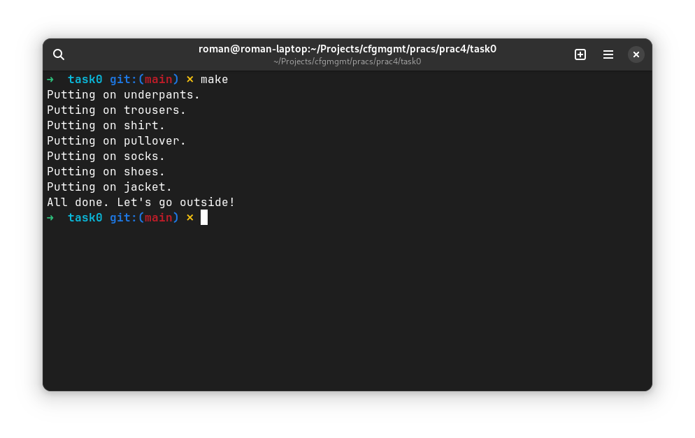
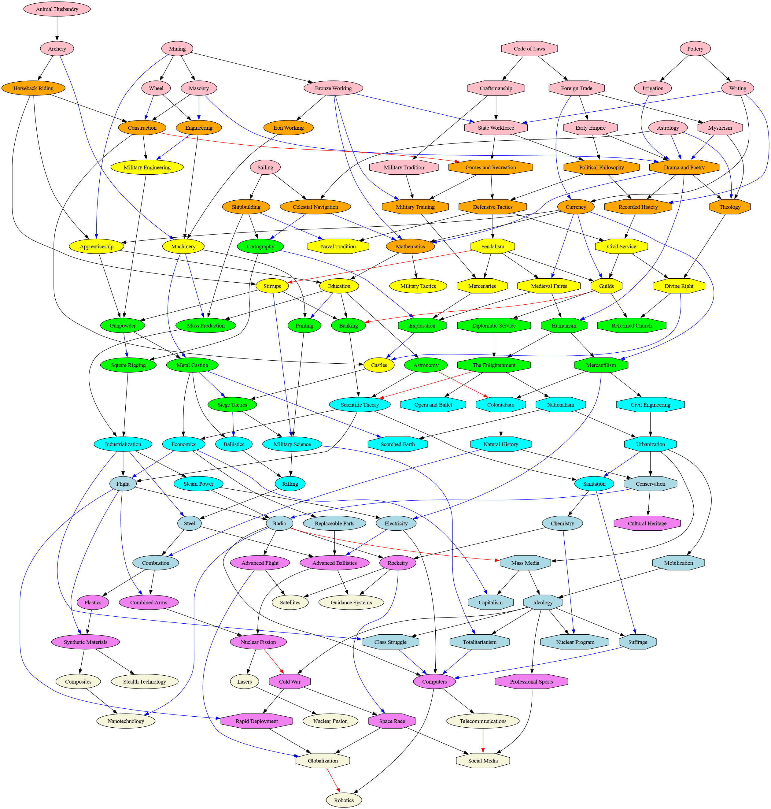
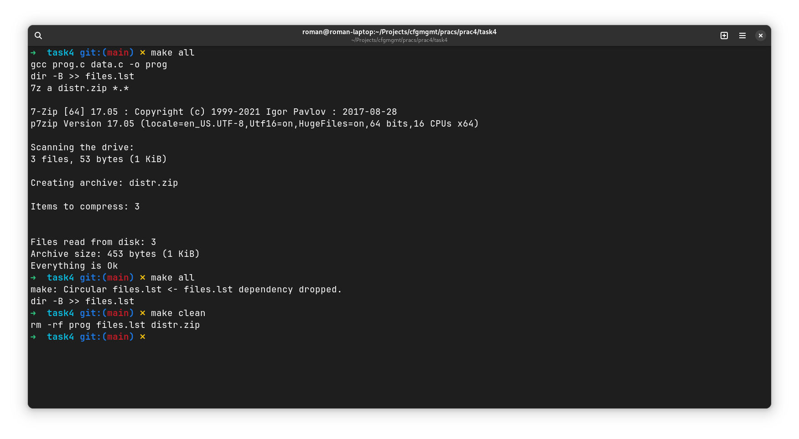

# Практическое задание №4. Системы автоматизации сборки

Работа с утилитой Make.

Изучить основы языка утилиты make.

## Задача 0

Создать приведенный ниже Makefile и проверить его работоспособность.

```
dress: trousers shoes jacket
    @echo "All done. Let's go outside!"

jacket: pullover
    @echo "Putting on jacket."

pullover: shirt
    @echo "Putting on pullover."

shirt:
    @echo "Putting on shirt."

trousers: underpants
    @echo "Putting on trousers."

underpants:
    @echo "Putting on underpants."

shoes: socks
    @echo "Putting on shoes."

socks: pullover
    @echo "Putting on socks."
```

Результат:


Визуализировать файл civgraph.txt.

Решение: выполним `dot -Tpng civgraph.txt > civgraph.png`.



## Задача 1

Написать программу на Питоне,    которая транслирует граф зависимостей civgraph в makefile в духе примера выше. Для мало знакомых с Питоном используется упрощенный вариант civgraph: [civgraph.json](task1/civgraph.json).

Пример:

```
> make mathematics
mining
bronze_working
sailing
astrology
celestial_navigation
pottery
writing
code_of_laws
foreign_trade
currency
irrigation
masonry
early_empire
mysticism
drama_poetry
mathematics
```

% Исходный код программы

```python task1/task1.py
```

% Полученный Makefile

```python task1/Makefile
```

## Задача 2

Реализовать вариант трансляции, при котором повторный запуск make не выводит для civgraph на экран уже выполненные "задачи".

% Исходный код программы

```python task2/task2.py
```

% Полученный Makefile

```python task2/Makefile
```

## Задача 3

Добавить цель clean, не забыв и про "животное".

% Исходный код программы

```python task3/task3.py
```

% Полученный Makefile

```python task3/Makefile
```

## Задача 4

Написать makefile для следующего скрипта сборки:

```
gcc prog.c data.c -o prog
dir /B > files.lst
7z a distr.zip *.*
```

Вместо gcc можно использовать другой компилятор командной строки, но на вход ему должны подаваться два модуля: prog и data.
Если используете не Windows, то исправьте вызовы команд на их эквиваленты из вашей ОС.
В makefile должны быть, как минимум, следующие задачи: all, clean, archive.
Обязательно покажите на примере, что уже сделанные подзадачи у вас не перестраиваются.

% Исходный код Makefile

```python task4/Makefile
```



В примере `files.lst` выполняется еще один раз, так как файл изменяется при первом запуске.

