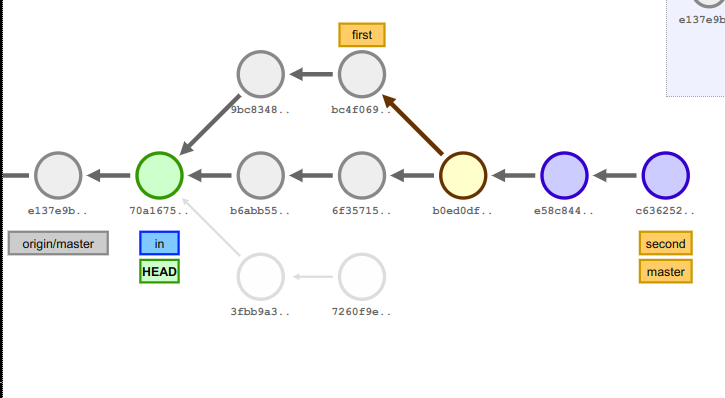

## Задача 1
На сайте https://onlywei.github.io/explain-git-with-d3 или http://git-school.github.io/visualizing-git/ (цвета могут отличаться, есть команды undo/redo) с помощью команд эмулятора git получить следующее состояние проекта (сливаем master с first, перебазируем second на master): Прислать свою картинку.



% Команды

```bash
git commit
git tag in
git branch first
git branch second
git commit
git commit
git checkout first
git commit
git commit
git checkout second
git commit
git commit
git checkout master
git merge first
git checkout second
git rebase master
git checkout master
git merge second
git checkout in
```

## Задача 2
Создать локальный git-репозиторий. Задать свои имя и почту (далее – coder1). Разместить файл prog.py с какими-нибудь данными. Прислать в текстовом виде диалог с git.

```bash
mkdir coder1
cd coder1
git init
git config user.name coder1
git config user.email coder1
echo 'print("hello world")' > prog.py
git add prog.py
git commit -m "add prog.py"
```

## Задача 3
Создать рядом с локальным репозиторием bare-репозиторий с именем server. Загрузить туда содержимое локального репозитория. Команда git remote -v должна выдать информацию о server! Синхронизировать coder1 с server.

Клонировать репозиторий server в отдельной папке. Задать для работы с ним произвольные данные пользователя и почты (далее – coder2). Добавить файл readme.md с описанием программы. Обновить сервер.

Coder1 получает актуальные данные с сервера. Добавляет в readme в раздел об авторах свою информацию и обновляет сервер.

Coder2 добавляет в readme в раздел об авторах свою информацию и решает вопрос с конфликтами.

Прислать список набранных команд и содержимое git log.

```bash
cd ..
mkdir server
cd server
git init --bare

cd ../coder1
git remote add origin ../server
git push --set-upstream origin master

cd ..
git clone server coder2
cd coder2
git config user.name coder2
git config user.email coder2
echo "Some program" >> readme.md
git add readme.md
git commit -m "add readme"
git push

cd ../coder1
git pull
echo "Authors:\ncoder1" >> readme.md
git add readme.md
git commit -m "add coder1 to readme.md"
git push

cd ../coder2
echo "coder2" >> readme.md
git add readme.md
git commit -m "add coder2 to readme.md"
git push  # ошибка merge conflict
git pull --no-ff
vim readme.md  # резолвим конфликт
git add readme.md
git commit -m "merge"
git push
```

% Вывод git log в server

```
commit a5319ae07bb6ceb5024a02621558e96bed18a2ed
Merge: bf944e8 2428594
Author: coder2 <coder2>
Date:   Sun Oct 29 17:16:52 2023 +0300

    merge

commit bf944e8904a928253288293b9751f03e83ddc08e
Author: coder2 <coder2>
Date:   Sun Oct 29 17:07:19 2023 +0300

    add coder2 to readme.md

commit 24285946e14546975a83f2259a3072903e82dcd4
Author: coder1 <coder1>
Date:   Sun Oct 29 17:07:06 2023 +0300

    add coder1 to readme.md

commit 25f661347bca461164638edef9ac495b6cccaa05
Author: coder2 <coder2>
Date:   Sun Oct 29 17:06:57 2023 +0300

    add readme

commit 050b4056720ee14b70f55a4c7f0717b84bdf53c2
Author: coder1 <coder1>
Date:   Sun Oct 29 17:06:33 2023 +0300

    add prog.py
```

## Задача 4

Написать программу на Питоне (или другом ЯП), которая выводит список содержимого всех объектов репозитория. Воспользоваться командой "git cat-file -p". Идеальное решение – не использовать иных сторонних команд и библиотек для работы с git.

```python task4.py
```