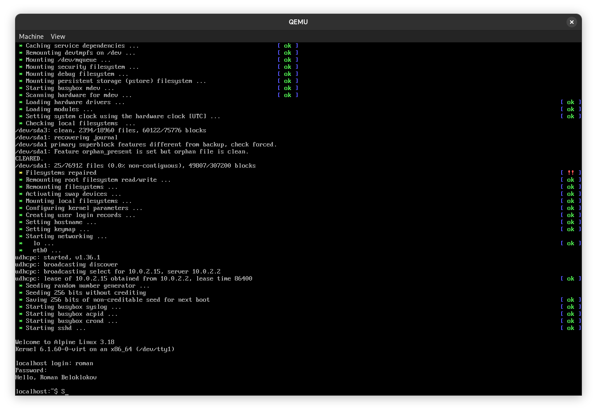

# Практическое занятие №7. Вопросы виртуализации

## Задача 1

Опишите по шагам, что делает каждая из следующих команд (приведите эквивалентное выражение на Python):

    11          0 LOAD_FAST                0 (x)

                2 LOAD_CONST               1 (10)

                4 BINARY_MULTIPLY

                6 LOAD_CONST               2 (42)

                8 BINARY_ADD

                10 RETURN_VALUE


1. LOAD_FAST 0 (x): Загружает значение переменной x из локальной области видимости по индексу 0.

2. LOAD_CONST 1 (10): Загружает константу 10.

3. BINARY_MULTIPLY: Выполняет операцию умножения между двумя верхними значениями в стеке (значение x и 10), результат кладется обратно в стек. Теперь стек содержит результат умножения x на 10.

4. LOAD_CONST 2 (42): Загружает константу 42.

5. BINARY_ADD: Выполняет операцию сложения между двумя верхними значениями в стеке (результат предыдущего умножения и 42), результат кладется обратно в стек. Теперь стек содержит результат сложения x * 10 и 42.

6. RETURN_VALUE: Возвращает верхнее значение из стека как результат выполнения функции.

Таким образом, данная последовательность команд эквивалентна следующему выражению на Python:

```python
return x * 10 + 42
```

Это выражение умножает значение переменной x на 10, затем прибавляет к результату 42 и возвращает итоговое значение.


## Задача 2

Что делает следующий байткод (опишите шаги его работы)? Это известная функция, назовите ее.

```
  5           0 LOAD_CONST               1 (1)
              2 STORE_FAST               1 (r)

  6     >>    4 LOAD_FAST                0 (n)
              6 LOAD_CONST               1 (1)
              8 COMPARE_OP               4 (>)
             10 POP_JUMP_IF_FALSE       30

  7          12 LOAD_FAST                1 (r)
             14 LOAD_FAST                0 (n)
             16 INPLACE_MULTIPLY
             18 STORE_FAST               1 (r)

  8          20 LOAD_FAST                0 (n)
             22 LOAD_CONST               1 (1)
             24 INPLACE_SUBTRACT
             26 STORE_FAST               0 (n)
             28 JUMP_ABSOLUTE            4

  9     >>   30 LOAD_FAST                1 (r)
             32 RETURN_VALUE
```

Данный байткод соответствует следующему коду:

```python
r = 1
while n > 1:
    r = n * r
    n -= 1
return r
```

Этот код соответствует функции `math.factorial`.


## Задача 3

Приведите результаты из задач 1 и 2 для виртуальной машины JVM (Java) или .Net (C#).

```
0: iload_0
1: bipush        10
3: imul
4: bipush        42
6: iadd
7: ireturn
```

```
 0: iconst_1
 1: istore_1
 2: iload_0
 3: iconst_1
 4: if_icmple     17
 7: iload_0
 8: iload_1
 9: imul
10: istore_1
11: iinc          0, -1
14: goto          2
17: iload_1
18: ireturn
```

## Задача 4

Работа с qemu. Скачать и установить ISO-образ Alpine Linux для виртуальных машин с официального сайта.
Создать с помощью qemu образ жесткого диска (опция -f qcow2). Объем диска 500 Мб.
Запустить Alpine Linux с CD-ROM.
Установить систему на sda. Изменить motd.
Загрузиться уже с sda.
Прислать список команд для работы с qemu и скриншот в духе следующего (должны фигурировать ваши имя и фамилия), см. рисунок ниже.

Команды: 

```
qemu-img create -f qcow2 alpine.img 500M

qemu-system-x86_64 -boot d -cdrom alpine-virt-3.18.4-x86_64.iso -m 2048 -display gtk -accel kvm -drive file=alpine.img  # загрузка с cdrom

qemu-system-x86_64 -boot d -m 2048 -display gtk -accel kvm -drive file=alpine.img  # загрузка с sda
```



